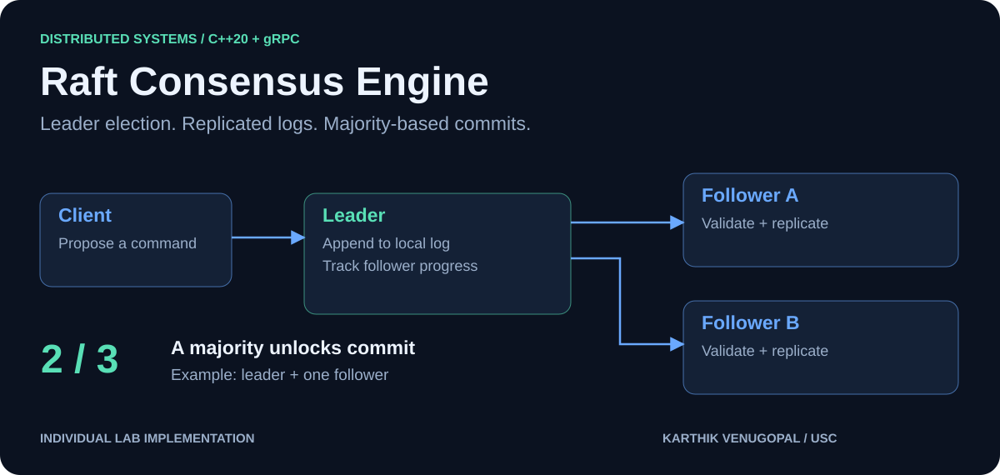
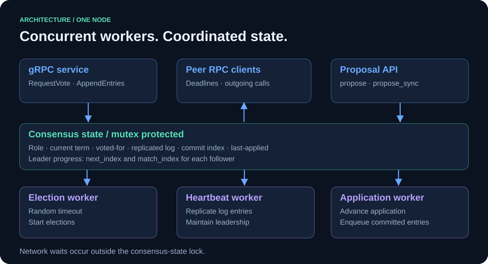
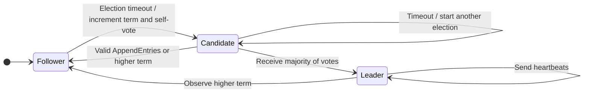
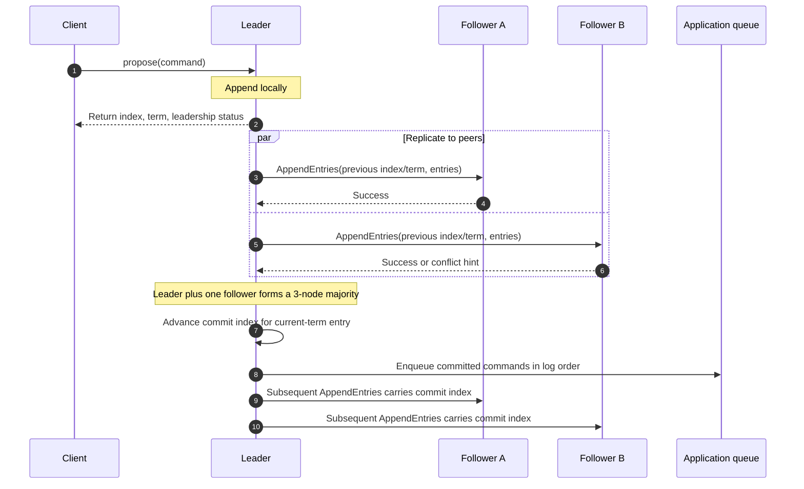
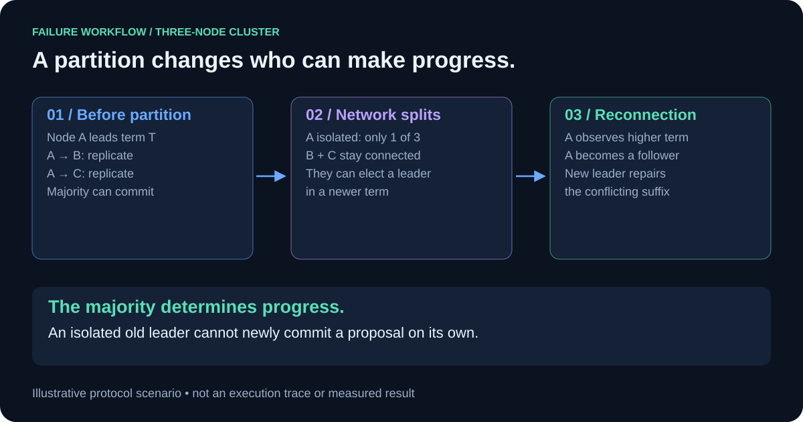

  

# Raft Consensus Engine

**Independent lab implementation by Karthik Venugopal · USC Distributed Systems**

### One ordered log. Multiple nodes. Agreement through failures.

Implemented Raft in **C++20 with gRPC**, coordinating independent server processes through leader election, replicated logs, and majority-based commits. The engineering challenge: keeping nodes in agreement while leaders change, messages fail, and disconnected followers return with conflicting histories.

This repository presents my individual Raft lab work through architecture diagrams, protocol workflows, and implementation details. It is a **documentation-only portfolio**; source code and course infrastructure are not distributed here.

[Architecture](#architecture) · [Elections](#leader-election) · [Replication](#from-proposal-to-commit) · [Failure handling](#when-the-network-splits) · [Test scenarios](#test-scenarios)

## Project at a glance

| Area | What I implemented |
| --- | --- |
| Consensus | Follower/candidate/leader transitions, randomized elections, majority voting, and heartbeats |
| Replication | AppendEntries, per-follower progress tracking, consistency checks, and conflicting-suffix repair |
| Commit handling | Majority checks for current-term entries and ordered delivery to an application queue |
| Client interface | Asynchronous proposals and a synchronous API that waits on application progress or leadership change |
| Concurrency | Election, heartbeat, and application workers; mutex-protected state; condition variables |
| Transport | Protocol Buffer messages, gRPC services and peer stubs, and individual RPC deadlines |

## Architecture

Every node runs the same consensus engine. Its role changes with elections; its RPC service remains available to receive votes and replicated entries.

| Layer | Responsibility | Original source component |
| --- | --- | --- |
| Protocol | RequestVote, AppendEntries, log entries, conflict hints | `proto/raft.proto` |
| Consensus | Elections, replication, commits, proposals | `src/raft.cpp` |
| Node state | Terms, votes, log, role, follower progress, synchronization | `inc/rafty/raft.hpp` |
| Runtime | Server lifecycle, peer connections, application delivery | `inc/rafty/impl/raft.ipp` |
| Cluster harness | Node processes, connectivity controls, orchestration | `app/`, `inc/toolings/` |
| Validation | Election, agreement, partition, rejoin, RPC-cost scenarios | `integration_tests/` |

Outgoing RPCs execute outside the consensus-state lock, allowing other workers and inbound handlers to access state while a network call is pending. Reply handling checks the current role and term before processing the corresponding result.

## Leader election

Election timeouts are randomized between **250–500 ms**. A candidate increments its term, votes for itself, and requests peer votes. Voting checks the term, voting eligibility, and whether the candidate's log is sufficiently up to date.

The heartbeat worker wakes roughly every **50 ms** and also receives a notification when a proposal arrives. RequestVote calls have **200 ms** deadlines; AppendEntries calls have **100 ms** deadlines. These are implementation settings, not measured latency guarantees.

## From proposal to commit

The leader first appends a command locally. Commit advancement then checks that a majority has replicated the entry and that it belongs to the leader's current term.

**Two proposal interfaces:** `propose()` returns an index and term without waiting for commit. `propose_sync()` waits on application progress, node termination, or a change in leadership/term. Its completion condition uses the application index; it does not acknowledge that an external consumer has finished executing the command.

### Repairing a divergent follower

1. The follower checks the preceding log index and term in AppendEntries.
2. If the prefix does not match, it returns a conflict term and/or index.
3. The leader adjusts that follower's `next_index`, skipping a conflicting term when possible.
4. A subsequent attempt replaces the conflicting suffix and catches the follower up.

Conflict hints avoid relying exclusively on one-entry-at-a-time backtracking across divergent log regions.

## When the network splits

This is an illustrative protocol scenario, not a captured execution. An isolated old leader may still believe it is leader and accept a local proposal, but cannot newly commit it without a majority. The two connected nodes can elect a leader and continue once they establish a majority. After reconnection, higher-term messages cause the old leader to step down and log reconciliation can repair its uncommitted suffix.

## Engineering decisions

| Decision | Why it matters |
| --- | --- |
| Randomized election timeouts | Reduce repeated contention between candidates |
| Per-follower `next_index` and `match_index` | Track independent replication progress and determine majority agreement |
| Conflict-term/index replies | Help the leader move past divergent log regions efficiently |
| Current-term commit check | Implements Raft's restriction on advancing commit by counting replicas |
| RPCs outside the state lock | Avoid holding the consensus lock across network waits |
| Condition variables | Coordinate proposals and application progress with background workers |
| Ordered application queue | Separate consensus progress from application consumption |

## Test scenarios

The original GoogleTest integration suite includes **15 named tests** in `raft_test.cpp`, plus an example test in `raft_test_extra.cpp`.

| Scenario family | Representative source tests | Behavior exercised |
| --- | --- | --- |
| Elections | `InitialElectionA`, `ReElectionA`, `ManyElectionA` | Initial leadership and reelection |
| Leadership transitions | `LeaderStepsDownOnHigherTermA`, `RapidLeaderChurnA` | Higher-term transitions and repeated turnover |
| Agreement | `BasicAgreeB`, `ManyAgreeB`, `ConcurrentStartsB` | Sequential and concurrent proposals |
| Connectivity loss | `FailAgreeB`, `FailNoAgreeExtraB` | Progress with sufficient replicas; no agreement without a majority |
| Reconciliation | `RejoinB`, `BackupExtraB`, `AgreeOnSplitBrainExtraB` | Follower rejoin, divergent histories, partitions |
| Communication cost | `RPCBytesB`, `RPCCountB` | Transferred-byte and RPC-count checks |

**Validation status:** these are tests present in the source project, not a fresh verified passing run or measured benchmark. Test executables are not included in this documentation repository.

## Lab scope

The original source labels the implementation **Labs 1–3**, with the synchronous proposal API explicitly marked as Lab 3. This page describes the inspected implementation rather than asserting completion against an unavailable assignment rubric. Earlier Lab 0 RPC exercises are outside this summary.

| Included | Outside this implementation's scope |
| --- | --- |
| In-memory terms, votes, replicated log | Durable persistence and crash-restart recovery |
| Elections, heartbeats, majority commits | Dynamic membership |
| Conflict repair and follower catch-up | Snapshots and log compaction |
| Asynchronous and synchronous proposals | A production storage service |

## Resume summary

> Implemented Raft consensus in C++20 with gRPC and Protocol Buffers, including randomized leader election, majority-based log replication, conflict repair, and synchronous proposals; integrated with a distributed test harness covering partitions, leader turnover, concurrent proposals, follower rejoin, and RPC overhead.

---

**Author:** Karthik Venugopal · **Context:** USC Distributed Systems lab · **Stack:** C++20 / gRPC / Protocol Buffers / CMake / GoogleTest / Abseil / spdlog
